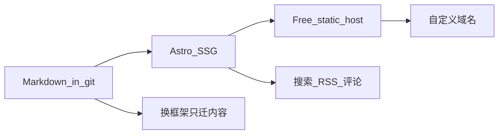

# 最小成本个人博客 Demo

## 选定方案

- **路径**：[`F:\NewIdea\tech-notes`](F:\NewIdea\tech-notes)（在 `F:\NewIdea` 下新建文件夹）
- **框架**：Astro（静态输出）
- **内容**：`src/content/blog/*.md` + Content Collections
- **本阶段目标**：本地可预览的 demo；不上线、不接评论/搜索/CMS
- **成本**：仅本地 Node；后续可免费静态托管

## Demo 范围

- 首页、文章页、标签页
- 3 篇中文样例（技术方案 / 学习笔记）
- 可读响应式样式
- 不做：数据库、后台、评论、RSS、自定义域名配置（仅 README 提及）

## 目标目录结构

```
F:\NewIdea\tech-notes\
  src/
    content/blog/*.md
    content.config.ts
    layouts/BaseLayout.astro
    pages/index.astro
    pages/blog/[...slug].astro
    pages/tags/[tag].astro
    styles/global.css
  public/
  astro.config.mjs
  package.json
  README.md
```

## 分步实施（最小粒度 + 验收）

### S01 — 创建项目目录

- **做**：确认 `F:\NewIdea` 存在；创建 `F:\NewIdea\tech-notes`
- **验收**：`Test-Path F:\NewIdea\tech-notes` 为 `$true`

### S02 — 切换工作区根目录

- **做**：调用 `cursor-app-control` 的 `move_agent_to_root`，根目录设为 `F:\NewIdea\tech-notes`
- **验收**：后续读写路径均相对该目录；不再在 home 目录写项目文件

### S03 — 初始化 Git

- **做**：在项目目录执行 `git init`
- **验收**：存在 `.git`；`git status` 可运行

### S04 — 初始化 Astro 最小项目

- **做**：创建 `package.json`、`astro.config.mjs`、基础 `src/pages`；安装 `astro` 依赖（minimal，不塞多余集成）
- **验收**：
  - `package.json` 含 `dev` / `build` 脚本
  - `npx astro --version` 或 `npm run build` 能识别 Astro 项目（S12 再做完整 build）

### S05 — Content Collection schema

- **做**：新增 `src/content.config.ts`（或 Astro 当前推荐路径），定义 `blog` collection：`title`、`description`、`pubDate`、`tags`、`draft`
- **验收**：schema 文件存在；字段齐全；空目录 `src/content/blog/` 已创建

### S06 — 布局与全局样式

- **做**：`BaseLayout.astro`（站点名、`<slot />`、基础 meta）；`global.css`（阅读宽度、中文排版、非系统默认字体栈）
- **验收**：任意页引用布局后 HTML 含站点标题与主内容槽；样式文件被引入

### S07 — 首页文章列表

- **做**：`pages/index.astro` 读取 blog collection，按 `pubDate` 倒序列出标题、日期、摘要、链接；过滤 `draft: true`
- **验收**：有文章时首页出现列表项；无文章时不报错（空状态可接受）

### S08 — 文章详情页

- **做**：`pages/blog/[...slug].astro`：`getStaticPaths` + 渲染 Markdown 正文（标题、代码块、列表）
- **验收**：访问某篇 slug 返回 200；正文含 frontmatter 标题与 Markdown 渲染结果

### S09 — 标签页

- **做**：`pages/tags/[tag].astro`：按 tag 列出文章；文章页/首页 tag 可点到该页
- **验收**：已知 tag 打开列表正确；首页或文章内 tag 链接可点通

### S10 — 样例内容

- **做**：在 `src/content/blog/` 写入 3 篇中文 `.md`：
  1. 技术方案类（含代码块）
  2. 学习笔记类
  3. 另一篇带多 tag（用于验标签页）
- **验收**：3 个文件均有合法 frontmatter；至少 1 篇含 fenced code block；tags 覆盖 ≥2 个不同标签

### S11 — 开发服务器冒烟

- **做**：`npm run dev`，用浏览器或请求检查首页、一篇文章、一个标签页
- **验收**：
  - 首页可见站点名与 ≥1 篇文章
  - 点进文章可见正文与代码块
  - 标签页只显示该 tag 文章

### S12 — 生产构建

- **做**：`npm run build`
- **验收**：退出码 0；`dist/` 存在且含首页与文章 HTML

### S13 — README

- **做**：写清 Node 要求、`npm install`、`npm run dev`、`npm run build`、如何新增文章、后期 Cloudflare Pages / GitHub Pages 免费部署一句话
- **验收**：按 README 仅需上述命令即可本地跑通；未引入必须付费步骤

## 后期可转型（本 demo 不实现）



## 总验收（全部步骤完成后）

- 路径为 `F:\NewIdea\tech-notes`
- S01–S13 各自验收通过
- 本地 `dev` + `build` 均成功
